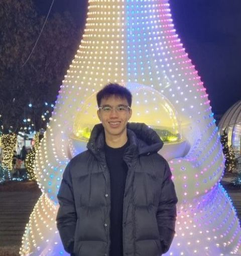

# About Us

We are a team based in the [School of Computing, National University of Singapore](http://www.comp.nus.edu.sg).

You can reach us at the email `seer[at]comp.nus.edu.sg`

## Project team

### Tan Yeong Teng Justin

[[github](http://github.com/cyprux)]
[[portfolio](team/johndoe.md)]

- Role: Developer
- Responsibilities: UI

### Yap Shao Wen

[[github](https://github.com/yapshaowen)]

* Role: Scheduling and deadline

### Cody

[[github](http://github.com/codcod30)]
[[portfolio](team/johndoe.md)]

* Role: Developer
* Responsibilities: Data

### Jackson Chia Dong

[[github](https://github.com/jacksoncddd)]

* Role: Data Gooner

### Tan Min Zhe

[[github](http://github.com/TMinZhe)]
[[portfolio](team/johndoe.md)]

- Role: Developer
- Responsibilities: Dev Ops + Threading

