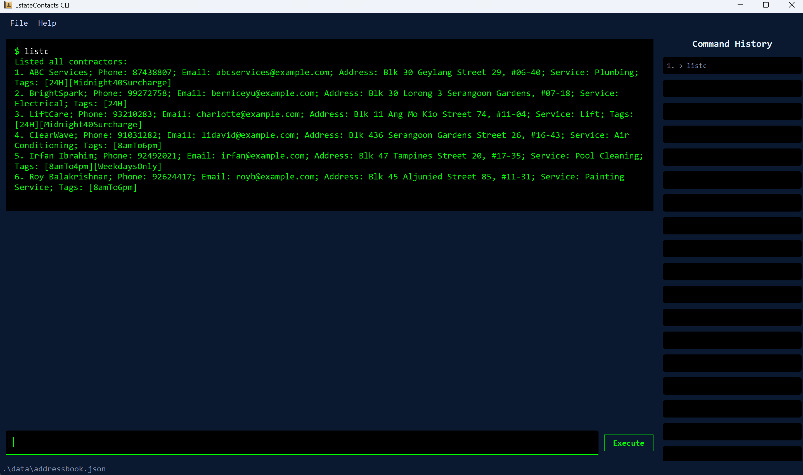
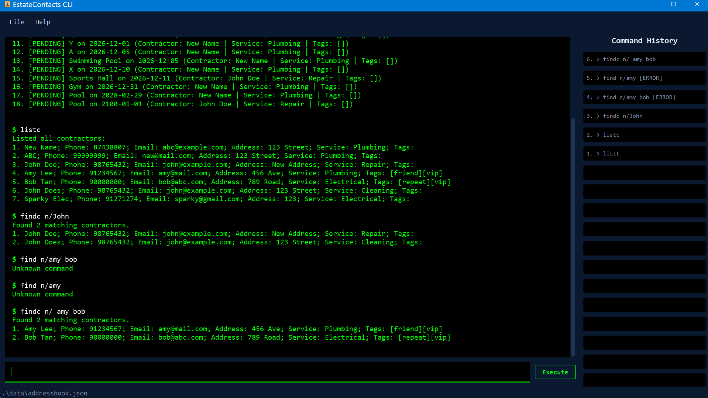

# EstateContacts User Guide

EstateContacts is a **desktop address book app for managing contacts, optimized for use via a  Line Interface** (CLI) while still having the benefits of a Graphical User Interface (GUI). If you can type fast, EstateContacts can get your contact management tasks done faster than traditional GUI apps.

---
Table of Contents

<!-- * Table of Contents -->
<page-nav-print />

--------------------------------------------------------------------------------------------------------------------

## Quick start

1. Ensure you have Java `17` or above installed in your Computer. 
   **Mac users:** Ensure you have the precise JDK version prescribed [here](https://se-education.org/guides/tutorials/javaInstallationMac.html).

1. Download the latest `.jar` file from [here](https://github.com/AY2526S2-CS2103-F13-3/tp/releases).

1. Copy the file to the folder you want to use as the _home folder_ for your AddressBook.

1. Open a command terminal, `cd` into the folder you put the jar file in, and use the `java -jar addressbook.jar` command to run the application. 
   A GUI similar to the below should appear in a few seconds. Note how the app contains some sample data. 
   

1. Type the command in the command box and press Enter to execute it. e.g. typing **`help`** and pressing Enter will open the help window. 
   Some example commands you can try:

   * `listc` : Lists all contacts.

   * `addc n/John Doe p/98765432 e/johnd@example.com a/John street, block 123, #01-01 s/Plumbing` : Adds a contact named `John Doe` to EstateContacts.

   * `delc 3` : Deletes the 3rd contact shown in the current list.

   * `clear confirm` : Deletes all contacts and tasks.

   * `exit` : Exits the app.

1. Refer to the [Features](#features) below for details of each command.

--------------------------------------------------------------------------------------------------------------------

## Features

<box type="info" seamless>

**Notes about the command format:** 

* Words in `UPPER_CASE` are the parameters to be supplied by the user. 
  e.g. in `addc n/NAME`, `NAME` is a parameter which can be used as `addc n/John Doe`.

* Items in square brackets are optional. 
  e.g. `n/NAME [t/TAG]` can be used as `n/John Doe t/friend` or as `n/John Doe`.

* Items with `…`​ after them can be used multiple times including zero times. 
  e.g. `[t/TAG]…​` can be used as ` ` (i.e. 0 times), `t/friend`, `t/friend t/family` etc.

* Parameters can be in any order. 
  e.g. if the command specifies `n/NAME p/PHONE_NUMBER`, `p/PHONE_NUMBER n/NAME` is also acceptable.

* Extraneous parameters for commands that do not take in parameters (such as `help`, `list`, `exit`) will be ignored. 
  e.g. if the command specifies `help 123`, it will be interpreted as `help`.

* If you are using a PDF version of this document, be careful when copying and pasting commands that span multiple lines as space characters surrounding line-breaks may be omitted when copied over to the application.
</box>

### Contractor features

---

### Adding a contractor : `addc`

Adds a contractor to EstateContacts.

Format: `addc n/NAME p/PHONE_NUMBER e/EMAIL a/ADDRESS s/SERVICE [t/TAG]…`

* Emails should be of the format local-part@domain
* The local-part should only contain alphanumeric characters and (+ _ . -) excluding the paranthesis
* The local-part may not start or end with any special characters
* The local-part should be followed by a '@' and then a domain
* The domain is made up of domain labels separated by periods
* The domain must end with a domain label at least 2 characters long
* Each domain label must start and end with alphanumeric characters
* Each domain label must consist of alphanumeric characters separated only by hyphens (if any)

<box type="tip" seamless>

**Tip:** A contractor can have any number of tags (including 0)
</box>

Examples:
* `addc n/John Doe p/98765432 e/johnd@example.com a/John street, block 123, #01-01 s/Plumbing`
* `addc n/Betsy Crowe t/friend e/betsycrowe@example.com a/Newgate Prison p/1234567 s/Electrical t/criminal`

### Listing all contractors : `listc`

Shows a list of all contractors in EstateContacts.

Format: `listc`

### Locating contractors by name or service : `findc`

Finds contractors whose names (n/) or service (s/) contain any of the given keywords.

Format: `findc n/KEYWORD [MORE_KEYWORDS] or findc s/KEYWORD [MORE_KEYWORDS]`

* The search is case-insensitive. e.g `hans` will match `Hans`
* The order of the keywords does not matter. e.g. `Hans Bo` will match `Bo Hans`
* Only exact words will be matched e.g. `Han` will not match `Hans`
* Contractors matching at least one keyword will be returned (i.e. `OR` search).
  e.g. `Hans Bo` will return `Hans Gruber`, `Bo Yang`

Caution:
* `findc` returns the filtered list, so it will affect other commands that uses contractor index.
* If you used `findc` as the most recent command, use `findc` contractor index instead of `listc` contractor index.
 

Examples:
* `findc n/John` returns `john` and `John Doe`
* `findc n/amy bob` returns `Amy Lee`, `Bob Tan` 
  

### Deleting a contractor : `delc`

Deletes the specified contractor from EstateContacts.

Format: `delc INDEX`

* Deletes the contractor at the specified `INDEX`.
* The index refers to the index number shown in the displayed contractor list.
* The index **must be a positive integer** 1, 2, 3

<box type="warning" seamless>

**Caution:** Deleting a contractor will **not** delete their associated maintenance tasks. Any tasks previously assigned to the deleted contractor will still appear in the task list, but the contractor will be shown as `Unknown (deleted)`. It is recommended to delete associated tasks via `delt` before deleting a contractor.

</box>

Examples:
* `listc` followed by `delc 2` deletes the 2nd contractor in EstateContacts.
* `findc n/Betsy` followed by `delc 1` deletes the 1st contractor in the results of the `findc` command.

### Editing a contractor : `editc`

Edits the details of the contractor identified by the index number shown in the displayed contractor list.

Format: `editc INDEX [n/NAME] [p/PHONE] [e/EMAIL] [a/ADDRESS] [s/SERVICE] [t/TAG]...`

* Existing values will be overwritten by the input values.
* At least one field must be provided.
* The index refers to the index number shown in the displayed contractor list.
* The index **must be a positive integer** 1, 2, 3

Example:
* `editc 1 p/91234567 e/johndoe@example.com`

### Maintenance task features

---

### Adding a task : `addt`

Adds a maintenance task and assigns it to a contractor in EstateContacts.

Format: `addt f/FACILITY d/DATE c/CONTRACTOR_INDEX`

* `FACILITY` must be between 1 and 50 characters.
* `DATE` must be in `YYYY-MM-DD` format and must not be in the past.
* `CONTRACTOR_INDEX` refers to the index number shown in the **currently displayed contractor list**.
* The index **must be a positive integer** 1, 2, 3
* The date must be in YYYY-MM-DD format.

<box type="warning" seamless>

**Caution:** Always run `listc` before using `addt` to ensure the contractor index refers to the full list. If you run `findc` first and then use `addt`, the index will be based on the filtered list which may assign the task to the wrong contractor.
</box>

<box type="tip" seamless>

**Tip:** A task cannot be added if another task for the same facility on the same date already exists.
</box>

Examples:
* `listc` followed by `addt f/Sports Hall d/2026-12-01 c/2` adds a task for Sports Hall on 1 Dec 2026 assigned to the 2nd contractor in the full list.
* `listc` followed by `addt f/Function Room d/2026-06-20 c/4` adds a task for Function Room on 20 Jun 2026 assigned to the 4th contractor.

### Listing all tasks : `listt`

Shows a list of all tasks in EstateContacts.

Format: `listt`

### Editing a task : `editt`

Edits the specified task from EstateContacts.

Format: `editt INDEX [f/FACILITY] [d/DATE] [c/CONTRACTOR_INDEX]`

* Existing values will be overwritten by the input values.
* At least one field must be provided.
* The index refers to the index number shown in the displayed maintenance tasklist.
* The index **must be a positive integer** 1, 2, 3
* The date must be in YYYY-MM-DD format.

Caution: Refer to `addt` caution section.

Examples:
* `editt 1 f/FunctionRoom d/2026-12-15`

### Deleting a task : `delt`

Deletes the specified task from EstateContacts.

Format: `delt INDEX`

* Deletes the task at the specified `INDEX`.
* The index refers to the index number shown in the displayed maintenance tasklist.
* Completed tasks (marked via `donet`) **cannot** be deleted, as they are kept for monthly reporting purposes.

Examples:
* delt 1

### Sorting tasks by date : `sortt`

Sorts the maintenance task list by date (ascending).

Format: `sortt`

### Marking a task as complete : `donet`

Marks the specified maintenance task as completed.

Format: `donet INDEX`

* Marks the task at the specified `INDEX` as done.
* The index refers to the index number shown in the displayed maintenance tasklist.
* The index **must be a positive integer** 1, 2, 3, …​
* A task that has already been marked as done cannot be marked again.

Examples:
* `listt` followed by `donet 1` marks the 1st task in the task list as completed.

### Viewing maintenance history for a facility : `history`

Shows a list of all maintenance tasks associated with a specific facility.

Format: `history f/FACILITY_NAME`

* Lists all tasks for the specified facility.
* If no tasks are found, a message will indicate that no maintenance history exists for that facility.

Examples:
* `history f/Sports Hall` displays the maintenance history for the "Sports Hall".
* `history f/Function Room` displays the maintenance history for the "Function Room".

### Generating a monthly report : `report`

Generates a summary report of all completed maintenance tasks for the specified month.

Format: `report m/YEAR-MONTH`

* `YEAR-MONTH` must be in the format `YYYY-MM` e.g. `2026-12`.
* Only completed tasks (marked via `donet`) are included in the report.
* Tasks are grouped by contractor, showing their name, service, tags and task count.

Examples:
* `report m/2026-12` generates a report for December 2026.
* `report m/2026-06` generates a report for June 2026.

### General features

---

### Viewing help : `help or f1 keyboard shortcut`

Shows a message explaining how to access the help page.

Format: `help`

### Clearing all entries : `clear confirm`

Clears all contractor entries and maintenance tasks from EstateContacts.

Format: `clear confirm`

### Exiting the program : `exit`

Exits the program.

Format: `exit`

### Saving the data

EstateContacts data are saved in the hard disk automatically after any command that changes the data. There is no need to save manually.

### Editing the data file

EstateContacts data are saved automatically as a JSON file `[JAR file location]/data/addressbook.json`. Advanced users are welcome to update data directly by editing that data file.

<box type="warning" seamless>

**Caution:**
If your changes to the data file makes its format invalid, AddressBook will discard all data and start with an empty data file at the next run.  Hence, it is recommended to take a backup of the file before editing it. 
Furthermore, certain edits can cause the AddressBook to behave in unexpected ways (e.g., if a value entered is outside the acceptable range). Therefore, edit the data file only if you are confident that you can update it correctly.
</box>

--------------------------------------------------------------------------------------------------------------------

## FAQ

**Q**: How do I transfer my data to another Computer? 
**A**: Install the app in the other computer and overwrite the empty data file it creates with the file that contains the data of your previous AddressBook home folder.

--------------------------------------------------------------------------------------------------------------------

## Known issues

1. **When using multiple screens**, if you move the application to a secondary screen, and later switch to using only the primary screen, the GUI will open off-screen. The remedy is to delete the `preferences.json` file created by the application before running the application again.
2. **If you minimize the Help Window** and then run the `help` command (or use the `Help` menu, or the keyboard shortcut `F1`) again, the original Help Window will remain minimized, and no new Help Window will appear. The remedy is to manually restore the minimized Help Window.

--------------------------------------------------------------------------------------------------------------------

## Command summary

Action          | Format, Examples
----------------|----------------------------------------------------------------------------------------------------------------------------------------------------------------------
**Add Contractor** | `addc n/NAME p/PHONE_NUMBER e/EMAIL a/ADDRESS s/SERVICE [t/TAG]…​`   e.g., `addc n/James Ho p/22224444 e/jamesho@example.com a/123, Clementi Rd, 1234665 s/Plumbing t/friend t/colleague`
**List Contractors** | `listc`
**Edit Contractor** | `editc INDEX [n/NAME] [p/PHONE] [e/EMAIL] [a/ADDRESS] [s/SERVICE] [t/TAG]…`   e.g., `editc 1 p/91234567 e/johndoe@example.com`
**Delete Contractor** | `delc INDEX`  e.g., `delc 3`
**Find Contractor(s)** | `findc n/KEYWORD [MORE_KEYWORDS]` or `findc s/KEYWORD [MORE_KEYWORDS]`  e.g., `findc n/James Jake`
**Add Task**    | `addt f/FACILITY d/DATE c/CONTRACTOR_INDEX`  e.g., `addt f/Sports Hall d/2026-12-01 c/2`
**List Tasks**  | `listt`
**Edit Task**  | `editt INDEX [f/FACILITY] [d/DATE)] [c/CONTRACTOR_INDEX]`   e.g., `editt 1 f/FunctionRoom d/2026-12-15`
**Delete Task** | `delt INDEX`  e.g., `delt 1`
**Done Task**   | `donet INDEX`  e.g., `donet 1`
**Sort Tasks**  | `sortt`
**History**     | `history f/FACILITY_NAME`  e.g., `history f/Sports Hall`
**Report**      | `report m/YEAR-MONTH`  e.g., `report m/2026-12`
**Clear**       | `clear confirm`
**Help**        | `help or f1 keyboard shortcut`
**Exit**        | `exit`
