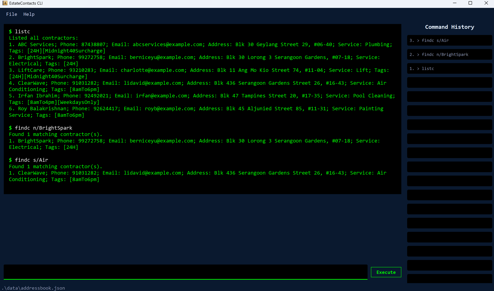

# EstateContacts User Guide

EstateContacts is a **desktop address book app for managing contacts, optimized for use via a Command Line Interface** (CLI) while still having the benefits of a Graphical User Interface (GUI). If you can type fast, EstateContacts can get your contact management tasks done faster than traditional GUI apps.

---

<!-- * Table of Contents -->
<page-nav-print />

--------------------------------------------------------------------------------------------------------------------

## Quick start

1. Ensure you have Java `17` or above installed in your Computer. 
   **Mac users:** Ensure you have the precise JDK version prescribed [here](https://se-education.org/guides/tutorials/javaInstallationMac.html).

2. Download the latest `.jar` file from [here](https://github.com/AY2526S2-CS2103-F13-3/tp/releases).

3. Copy the file to the folder you want to use as the _home folder_ for EstateContacts.

4. Open a command terminal, `cd` into the folder you put the jar file in, and use the `java -jar estatecontacts.jar` command to run the application. 
   A GUI similar to the below should appear in a few seconds. Note how the app contains some sample data. 
   

5. Type the command in the command box and press Enter to execute it. e.g. typing **`help`** and pressing Enter will open the help window. 
   Some example commands you can try:

   * `listc` : Lists all contacts.

   * `addc n/John Doe p/98765432 e/johnd@example.com a/John street, block 123, #01-01 s/Plumbing` : Adds a contact named `John Doe` to EstateContacts.

   * `delc 3` : Deletes the 3rd contact shown in the current list.

   * `clear confirm` : Deletes all contacts and pending tasks. Completed tasks are preserved for reporting.

   * `exit` : Exits the app.

6. Refer to the [Features](#features) below for details of each command.

--------------------------------------------------------------------------------------------------------------------

## Features

<box type="info" seamless>

**Notes about the command format:** 

* Words in `UPPER_CASE` are the parameters to be supplied by the user. 
  e.g. in `addc n/NAME`, `NAME` is a parameter which can be used as `addc n/John Doe`.

* Items in square brackets are optional. 
  e.g. `n/NAME [t/TAG]` can be used as `n/John Doe t/friend` or as `n/John Doe`.

* Items with `…`​ after them can be used multiple times including zero times. 
  e.g. `[t/TAG]…​` can be used as ` ` (i.e. 0 times), `t/friend`, `t/friend t/family` etc.

* Parameters can be in any order. 
  e.g. if the command specifies `n/NAME p/PHONE_NUMBER`, `p/PHONE_NUMBER n/NAME` is also acceptable.

* Extraneous parameters for commands that do not take in parameters (such as `help`, `listc`, `listt`, `sortt`, `exit`) will be ignored. 
  e.g. if the command specifies `help 123`, it will be interpreted as `help`.

* If you are using a PDF version of this document, be careful when copying and pasting commands that span multiple lines as space characters surrounding line-breaks may be omitted when copied over to the application.
</box>

### Contractor features

---

### Adding a contractor : `addc`

Adds a contractor to EstateContacts.

Format: `addc n/NAME p/PHONE_NUMBER e/EMAIL a/ADDRESS s/SERVICE [t/TAG]…`

Contractor field constraints:
* `NAME`: Must contain only alphanumeric characters and spaces, and must not be blank.
* `PHONE_NUMBER`: Must contain only digits, with length between 3 and 15 digits.
* `EMAIL`: Must be in the format `local-part@domain`.
  * `local-part`: Must use alphanumeric characters and `+_.-`, cannot start/end with a special character.
  * `domain`: Domain labels are separated by `.`; each label must start/end alphanumeric, may contain internal hyphens, and final label must be at least 2 characters.
* `ADDRESS`: Can contain any characters, but must not be blank.
* `SERVICE`: Must contain alphanumeric words separated by single spaces (no special characters).
* `TAG`: Must be alphanumeric (no spaces/special characters).

<box type="warning" seamless>

**Duplicate contractor rule:** A contractor is treated as a duplicate if at least one of the following matches an existing contractor:
* Exact `NAME` match (character-for-character).
* Exact `PHONE_NUMBER` match.
* Exact `EMAIL` match.

**Limitation:** `NAME` matching is case-sensitive and spacing-sensitive. For example, `John Doe`, `john doe`, and `John  Doe` are treated as different names.

</box>

<box type="tip" seamless>

**Tip:** A contractor can have any number of tags (including 0).
</box>

Examples:
* `addc n/John Doe p/98765432 e/johnd@example.com a/John street, block 123, #01-01 s/Plumbing`
* `addc n/Betsy Crowe t/friend e/betsycrowe@example.com a/Newgate Prison p/1234567 s/Electrical t/criminal`
* `addc n/AirCool Pte Ltd p/91234567 e/contact@aircool.com a/10 Industrial Road s/Air Con Servicing t/24H`

### Listing all contractors : `listc`

Shows a list of all contractors in EstateContacts.

Format: `listc`

### Locating contractors by name or service : `findc`

Finds contractors whose names or services contain any of the given keywords.

Format: `findc n/KEYWORD [MORE_KEYWORDS]…​` or `findc s/KEYWORD [MORE_KEYWORDS]…​`

**Field constraints:**
* Exactly one search prefix must be provided: either `n/` (search by name) or `s/` (search by service). Using both prefixes in one command is not allowed.
* At least one keyword must be provided after the prefix.

**Search behaviour:**
* The search is case-insensitive. e.g `hans` will match `Hans`.
* The order of the keywords does not matter. e.g. `Hans Bo` will match `Bo Hans`.
* Only **full words** are matched. e.g. `Han` will not match `Hans`.
* Contractors matching at least one keyword will be returned (i.e. `OR` search). e.g. `Hans Bo` will return `Hans Gruber`, `Bo Yang`.

<box type="warning" seamless>

**Caution:** `findc` filters the contractor list, so contractor indices change based on the currently displayed list. Always use the index shown in the **currently displayed list** when running commands that reference a contractor index (e.g. `addt c/INDEX`, `delc INDEX`, `editc INDEX`).

For example, if `listc` shows Rachel Ng at index 5, but `findc n/Rachel` shows her at index 1, use `c/1` to refer to her after `findc`.

</box>

Examples:
* `findc n/John` returns `john` and `John Doe`
* `findc n/amy bob` returns `Amy Lee`, `Bob Tan`
* `findc s/Air` returns contractors with service `Air`
  

### Deleting a contractor : `delc`

Deletes the specified contractor from EstateContacts.

Format: `delc INDEX`

* Deletes the contractor at the specified `INDEX`.
* The index refers to the index number shown in the displayed contractor list.
* The index **must be a positive integer** 1, 2, 3

<box type="warning" seamless>

**Caution:** Deleting a contractor will **not** delete their associated maintenance tasks. Any tasks previously assigned to the deleted contractor will still appear in the task list with the contractor's details preserved at the time the task was created. It is recommended to delete associated pending tasks via `delt` before deleting a contractor.
* After `delc INDEX`, contractors below that index shift up by 1. Example: deleting index 2 makes old index 3 become new index 2.

</box>

Examples:
* `listc` followed by `delc 2` deletes the 2nd contractor in EstateContacts.
* `findc n/Betsy` followed by `delc 1` deletes the 1st contractor in the results of the `findc` command.

### Editing a contractor : `editc`

Edits the details of the contractor identified by the index number shown in the displayed contractor list.

Format: `editc INDEX [n/NAME] [p/PHONE] [e/EMAIL] [a/ADDRESS] [s/SERVICE] [t/TAG]…​`

**Field constraints:**
* `INDEX`: Must be a positive integer (1, 2, 3, …​) referring to the index shown in the currently displayed contractor list.
* At least one optional field must be provided.
* All edited fields must satisfy the same field constraints listed under `addc`.

<box type="warning" seamless>

**Caution:**
* Providing `t/` without a tag value will clear **all** existing tags of the contractor.
* The duplicate contractor rule from `addc` also applies to edits — you cannot edit a contractor to a `NAME`, `PHONE_NUMBER`, or `EMAIL` that duplicates another existing contractor.
* After a successful `editc`, the contractor list resets to show **all** contractors (any active `findc` filter is cleared).

</box>

Examples:
* `editc 1 p/91234567 e/johndoe@example.com`

### Maintenance task features

---

### Adding a task : `addt`

Adds a maintenance task and assigns it to a contractor in EstateContacts.

Format: `addt f/FACILITY d/DATE c/CONTRACTOR_INDEX`

**Field constraints:**
* `FACILITY`: Must be between 1 and 50 characters (after trimming leading/trailing spaces).
* `DATE`: Must be in `YYYY-MM-DD` format and must be a valid calendar date (e.g. `2026-02-30` is invalid).
* `CONTRACTOR_INDEX`: Must be a positive integer referring to the index shown in the **currently displayed contractor list**.

<box type="warning" seamless>

**Caution:** A task cannot be added if another task for the same facility on the same date already exists.

</box>

<box type="tip" seamless>

**Tip:** You are allowed to add tasks with dates in the past (e.g. to retroactively log completed maintenance work). The task will be added successfully, but a warning message will be shown indicating that the task is scheduled in the past.
</box>

Examples:
* `listc` followed by `addt f/Sports Hall d/2026-12-01 c/2` adds a task for Sports Hall on 1 Dec 2026 assigned to the 2nd contractor in the displayed list.
* `listc` followed by `addt f/Function Room d/2026-06-20 c/4` adds a task for Function Room on 20 Jun 2026 assigned to the 4th contractor.

### Listing all tasks : `listt`

Shows a list of all tasks in EstateContacts.

Format: `listt`

### Editing a task : `editt`

Edits the specified task from EstateContacts.

Format: `editt INDEX [f/FACILITY] [d/DATE] [c/CONTRACTOR_INDEX]`

**Field constraints:**
* `INDEX`: Must be a positive integer (1, 2, 3, …​) referring to the index shown in the displayed maintenance task list.
* At least one optional field must be provided.
* `FACILITY`: Must be between 1 and 50 characters (after trimming leading/trailing spaces).
* `DATE`: Must be in `YYYY-MM-DD` format, must be a valid calendar date, and **must not be a date in the past**.
* `CONTRACTOR_INDEX`: Must be a positive integer referring to the index shown in the **currently displayed contractor list**.

<box type="warning" seamless>

**Caution:**
* Completed tasks (marked via `donet`) **cannot** be edited. Toggle the task back to pending using `donet INDEX` before editing.
* A task cannot be edited to have the same facility and date as another existing task.
* Unlike `addt`, past dates are **not** allowed when editing a task's date.
* Changing the contractor (`c/CONTRACTOR_INDEX`) will update the task's stored contractor name, service, and tags to match the new contractor at the time of the edit. If that contractor is later modified or deleted, the task retains the snapshot taken at edit time.

</box>

Examples:
* `editt 1 f/Function Room d/2026-12-15`

### Deleting a task : `delt`

Deletes the specified task from EstateContacts.

Format: `delt INDEX`

* Deletes the task at the specified `INDEX`.
* The index refers to the index number shown in the displayed maintenance task list.
* Completed tasks (marked via `donet`) **cannot** be deleted, as they are kept for monthly reporting purposes.

Examples:
* delt 1

### Sorting tasks by date : `sortt`

Sorts the maintenance task list by date (ascending).

Format: `sortt`

### Marking a task as complete : `donet`

Marks the specified maintenance task as completed.

Format: `donet INDEX`

* Marks the task at the specified `INDEX` as done.
* The index refers to the index number shown in the displayed maintenance task list.
* The index **must be a positive integer** 1, 2, 3, …​
* Running `donet` on a completed task will revert it to pending.

Examples:
* `listt` followed by `donet 1` marks the 1st task in the task list as completed.

### Viewing maintenance history for a facility : `history`

Shows a list of all maintenance tasks associated with a specific facility.

Format: `history f/FACILITY_NAME`

* Lists all tasks for the specified facility.
* If no tasks are found, a message will indicate that no maintenance history exists for that facility.

Constraints:
* The match is case-insensitive. e.g. `history f/sports hall` will match `Sports Hall`.
* Only exact facility names will be matched. e.g. `history f/Sports` will not match `Sports Hall`.
* `FACILITY_NAME` cannot be empty.

Examples:
* `history f/Sports Hall` displays the maintenance history for the "Sports Hall".
* `history f/Function Room` displays the maintenance history for the "Function Room".

### Generating a monthly report : `report`

Generates a summary report of all completed maintenance tasks for the specified month.

Format: `report m/YEAR-MONTH`

* `YEAR-MONTH` must be in the format `YYYY-MM` e.g. `2026-12`.
* Only completed tasks (marked via `donet`) are included in the report.
* Tasks are grouped by contractor, showing their name, service, tags and task count.

Examples:
* `report m/2026-12` generates a report for December 2026.
* `report m/2026-06` generates a report for June 2026.

### General features

---

### Viewing help : `help or F1 keyboard shortcut`

Shows a message explaining how to access the help page.

Format: `help`

### Clearing all entries : `clear confirm`

Permanently clears all contractor entries and pending maintenance tasks from EstateContacts. Completed tasks (`[DONE]`) are preserved for monthly reporting purposes.

Format: `clear confirm`

### Exiting the program : `exit`

Exits the program.

Format: `exit`

### Saving the data

EstateContacts data are saved in the hard disk automatically after any command that changes the data. There is no need to save manually.

### Editing the data file

EstateContacts data are saved automatically as JSON files:
* `[JAR file location]/data/addressbook.json` for contractors.
* `[JAR file location]/data/tasklist.json` for maintenance tasks.

Advanced users are welcome to update data directly by editing these data files.

<box type="warning" seamless>

**Caution:**
If your changes to a data file make its format invalid, EstateContacts will discard all data and start with empty data files at the next run. Hence, it is recommended to take a backup of the files before editing them. 
Furthermore, certain edits can cause EstateContacts to behave in unexpected ways (e.g., if a value entered is outside the acceptable range). Therefore, edit the data files only if you are confident that you can update them correctly.
</box>

--------------------------------------------------------------------------------------------------------------------

## FAQ

**Q**: How do I transfer my data to another Computer? 
**A**: Install the app in the other computer and overwrite the empty data files it creates (`addressbook.json` and `tasklist.json`) with the files from your previous EstateContacts home folder.

**Q**: Which command should I use to launch the app? 
**A**: Open a terminal in the folder containing the JAR file and run `java -jar estatecontacts.jar`.

**Q**: Where are my data files stored? 
**A**: They are stored in the app's home folder under `data/addressbook.json` and `data/tasklist.json`.

**Q**: Can I edit the JSON data files manually? 
**A**: Yes, but only if you are confident with the format. Invalid JSON or invalid field values may cause EstateContacts to reset data at the next launch.

**Q**: Why can't I delete some tasks using `delt`? 
**A**: Completed tasks (`[DONE]`) cannot be deleted. Toggle the task back to pending using `donet INDEX`, then run `delt INDEX`.

--------------------------------------------------------------------------------------------------------------------

## Known issues

1. **When using multiple screens**, if you move the application to a secondary screen, and later switch to using only the primary screen, the GUI will open off-screen. The remedy is to delete the `preferences.json` file created by the application before running the application again.
2. **If you minimize the Help Window** and then run the `help` command (or use the `Help` menu, or the keyboard shortcut `F1`) again, the original Help Window will remain minimized, and no new Help Window will appear. The remedy is to manually restore the minimized Help Window.

--------------------------------------------------------------------------------------------------------------------

## Command summary

Action          | Format, Examples
----------------|----------------------------------------------------------------------------------------------------------------------------------------------------------------------
**Add Contractor** | `addc n/NAME p/PHONE_NUMBER e/EMAIL a/ADDRESS s/SERVICE [t/TAG]…​`   e.g., `addc n/James Ho p/22224444 e/jamesho@example.com a/123, Clementi Rd, 1234665 s/Plumbing t/friend t/colleague`
**List Contractors** | `listc`
**Edit Contractor** | `editc INDEX [n/NAME] [p/PHONE] [e/EMAIL] [a/ADDRESS] [s/SERVICE] [t/TAG]…`   e.g., `editc 1 p/91234567 e/johndoe@example.com`
**Delete Contractor** | `delc INDEX`  e.g., `delc 3`
**Find Contractor(s)** | `findc n/KEYWORD [MORE_KEYWORDS]` or `findc s/KEYWORD [MORE_KEYWORDS]`  e.g., `findc n/James Jake`
**Add Task**    | `addt f/FACILITY d/DATE c/CONTRACTOR_INDEX`  e.g., `addt f/Sports Hall d/2026-12-01 c/2`
**List Tasks**  | `listt`
**Edit Task**  | `editt INDEX [f/FACILITY] [d/DATE] [c/CONTRACTOR_INDEX]`   e.g., `editt 1 f/FunctionRoom d/2026-12-15`
**Delete Task** | `delt INDEX`  e.g., `delt 1`
**Done Task**   | `donet INDEX`  e.g., `donet 1`
**Sort Tasks**  | `sortt`
**History**     | `history f/FACILITY_NAME`  e.g., `history f/Sports Hall`
**Report**      | `report m/YEAR-MONTH`  e.g., `report m/2026-12`
**Clear**       | `clear confirm`
**Help**        | `help or F1 keyboard shortcut`
**Exit**        | `exit`
